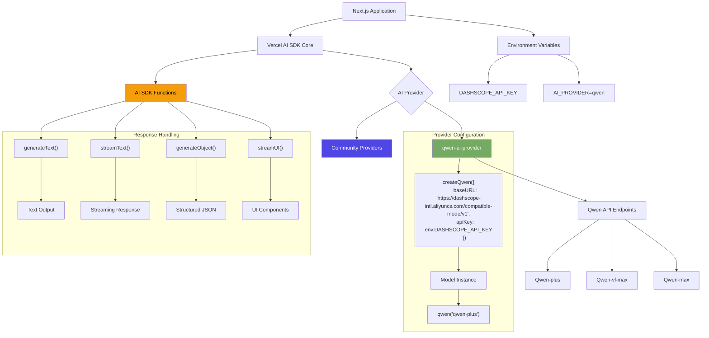

# Qwen AI Provider for Vercel AI SDK  
[](https://sdk.vercel.ai/providers/community-providers/qwen)


[younis-ahmed/qwen-vercel-ai-sdk-provider](https://github.com/younis-ahmed/qwen-ai-provider) enables seamless integration of **Alibaba Cloud's Qwen language models** with applications built using **Vercel AI SDK**. This community-maintained provider supports:  

- Full compatibility with Vercel AI SDK's `generateText`, `streamText`, and tool-calling functions.
- 15+ Qwen models including `qwen-plus`, `qwen-vl-max`, and `qwen2.5 series`.
- Customizable API configurations for enterprise deployments.

---


## Diagram
<!-- Description or alt text for the diagram -->
### Architecture diagram showing Qwen provider integration with Vercel AI SDK




---


## Enviroment Variable
```ts
DASHSCOPE_API_KEY=""
```

## Setup

The Qwen provider is available in the `qwen-ai-provider` module. You can install it with:

```bash
# For pnpm
pnpm add qwen-ai-provider
```

```bash
# For npm
npm install qwen-ai-provider
```

```bash
# For yarn
yarn add qwen-ai-provider
```

## Provider Instance

You can import the default provider instance `qwen` from `qwen-ai-provider`:

```ts
import { qwen } from 'qwen-ai-provider';
```

If you need a customized setup, you can import `createQwen` from `qwen-ai-provider` and create a provider instance with your settings:

```ts
import { createQwen } from 'qwen-ai-provider';

const qwen = createQwen({
  // optional settings, e.g.
  // baseURL: 'https://qwen/api/v1',
});
```

You can use the following optional settings to customize the Qwen provider instance:

- **baseURL** _string_

  Use a different URL prefix for API calls, e.g., to use proxy servers. The default prefix is `https://dashscope-intl.aliyuncs.com/compatible-mode/v1`.

- **apiKey** _string_

  API key that is being sent using the `Authorization` header. It defaults to the `DASHSCOPE_API_KEY` environment variable.

- **headers** _Record&lt;string,string&gt;_

  Custom headers to include in the requests.

- **fetch** _(input: RequestInfo, init?: RequestInit) => Promise&lt;Response&gt;_

  Custom [fetch](https://developer.mozilla.org/en-US/docs/Web/API/fetch) implementation. Defaults to the global `fetch` function. You can use it as a middleware to intercept requests, or to provide a custom fetch implementation for e.g., testing.

## Language Models

You can create models that call the [Qwen chat API](https://www.alibabacloud.com/help/en/model-studio/developer-reference/use-qwen-by-calling-api) using a provider instance. The first argument is the model id, e.g., `qwen-plus`. Some Qwen chat models support tool calls.

```ts
const model = qwen('qwen-plus');
```

### Example

You can use Qwen language models to generate text with the `generateText` function:

```ts
import { qwen } from 'qwen-ai-provider';
import { generateText } from 'ai';

const { text } = await generateText({
  model: qwen('qwen-plus'),
  prompt: 'Write a vegetarian lasagna recipe for 4 people.',
});
```
> **Note**
> Qwen language models can also be used in the `streamText`, `generateObject`, `streamObject`, and `streamUI` functions (see [AI SDK Core](/docs/ai-sdk-core) and [AI SDK RSC](/docs/ai-sdk-rsc)).

### Model Capabilities

| Model                     | Image Input | Object Generation | Tool Usage | Tool Streaming |
| ------------------------- | ------------------ | ----------------- | ------------------ | ------------------ |
| `qwen-vl-max`             | :heavy_check_mark: | :heavy_check_mark:| :heavy_check_mark: | :heavy_check_mark: |
| `qwen-plus-latest`        | :x:                | :heavy_check_mark:| :heavy_check_mark: | :heavy_check_mark: |
| `qwen-max`                | :x:                | :heavy_check_mark:| :heavy_check_mark: | :heavy_check_mark: |
| `qwen2.5-72b-instruct`    | :x:                | :heavy_check_mark:| :heavy_check_mark: | :heavy_check_mark: |
| `qwen2.5-14b-instruct-1m` | :x:                | :heavy_check_mark:| :heavy_check_mark: | :heavy_check_mark: |
| `qwen2.5-vl-72b-instruct` | :heavy_check_mark: | :heavy_check_mark:| :heavy_check_mark: | :heavy_check_mark: |

> **Note**  
> The table above lists popular models. Please see the [Qwen docs](https://www.alibabacloud.com/help/en/model-studio/getting-started/models) for a full list of available models. You can also pass any available provider model ID as a string if needed.

## Embedding Models

You can create models that call the [Qwen embeddings API](https://www.alibabacloud.com/help/en/model-studio/getting-started/models#cff6607866tsg) using the `.textEmbeddingModel()` factory method.

```ts
const model = qwen.textEmbeddingModel('text-embedding-v3');
```

### Model Capabilities

| Model               | Default Dimensions | Maximum number of rows | Maximum tokens per row |
| ------------------- | ------------------ | ---------------------- | ---------------------- |
| `text-embedding-v3` | 1024               | 6                      | 8,192                  |
